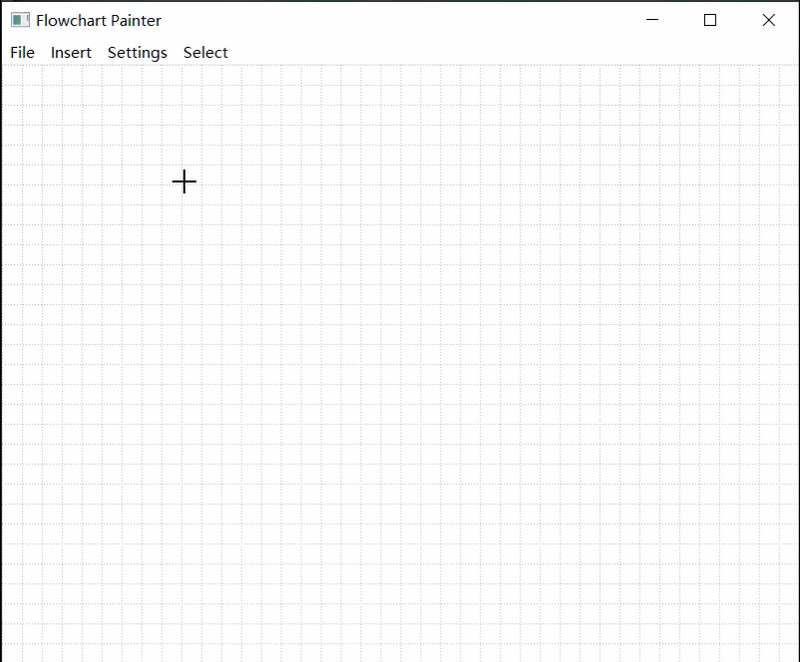

# 简易流程图编辑器



一个基于Qt开发的简易流程图编辑器，支持基本图形操作和富文本编辑。

## 🚀 功能特性

### 画布管理
- 支持预设或自定义大小的画布创建
- 画布文件(.flow)的新建、保存和加载功能

### 图形操作
- **基本图形**：支持矩形和椭圆形
- **图形编辑**：
  - 选中（加粗轮廓显示控制点）
  - 插入、拉伸、旋转（支持Shift键约束操作）
  - 双击图形进行富文本编辑（居中显示）
- **图形属性**：
  - 线条样式（颜色、实线/虚线、粗细）
  - 填充样式（颜色、透明度、有无填充）
- **图层管理**：
  - 支持调整图形叠放顺序
- **编辑操作**：
  - 复制、粘贴、剪切、删除

## 📦 项目结构

```plaintext
项目根目录/
├── Debug/
│   └── Debug/              # 生成的可执行文件和链接库
├── source/
│   └── ClassExamProject/   # 工程文件
│       ├── CMakeLists.txt  # CMake构建文件
│       ├── *.cpp           # 源代码文件
│       └── *.h             # 头文件
└── README.md               # 本文件
```

## 🛠 主要类说明

1. **MainWindow** - 主窗口实现
   - 菜单按钮功能
   - 四类主要功能：
     - 画布选项
     - 鼠标选择模式
     - 插入图形
     - 属性设置

2. **CanvasWidget** - 画布组件
   - 铺设在主窗口上
   - 接收动作后重新绘制

3. **Shape** - 图形基类
   - **Rectangle** - 矩形类
   - **Ellipse** - 椭圆形类
   - 共通功能实现
   - 各自特有的绘制和选中逻辑

4. **CanvasSetupDialog** - 画布设置对话框
   - 支持预设和自定义画布大小

5. **TextEditDialog** - 文本编辑对话框
   - 富文本编辑功能
   - 支持调整字体、颜色、字号、加粗、斜体等

## ⚙️ 构建与运行

```bash
# 克隆仓库
git clone https://github.com/yourusername/yourrepo.git
cd yourrepo

# 构建项目 (CMake示例，注意将thirdparty_install库放置至与ClassExamProject同级)
mkdir build && cd build
cmake ../source/ClassExamProject
make

# 运行程序
./Debug/Debug/ClassExamProject.exe
```

## 📌 已知问题
1. 未实现连接线功能，影响流程图体验
2. 新建画布时未清空现有元素
3. 加载画布文件时未清空现有元素
4. 图形元素种类较少（目前只有矩形和椭圆形）

## ✨ 项目亮点
- 图形操作细节精致，参考WPS/PPT的实现
- 完善的图形属性设置
- 支持富文本编辑
- 完整的图层管理功能
